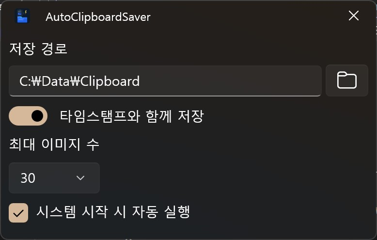

# AutoClipboardSaver

한국어 | **[English](README.md)**

WinUI 3로 구축된 경량 클립보드 이미지 자동 저장 앱

## 개요

AutoClipboardSaver는 클립보드를 자동으로 모니터링하여 이미지가 복사될 때마다 지정된 폴더에 저장하는 시스템 트레이 애플리케이션입니다. 최소한의 리소스 사용으로 백그라운드에서 조용히 실행됩니다.

트레이 아이콘을 클릭하여 설정 창을 열고 앱을 구성할 수 있습니다.

## 기능

- **자동 클립보드 모니터링** — 클립보드 이미지 변경을 실시간으로 감지하여 JPEG 파일로 저장
- **타임스탬프 모드** — 각 이미지를 고유한 타임스탬프 파일명으로 저장하거나, 단일 `clipboard.jpg` 파일에 덮어쓰기
- **최대 이미지 수 제한** — 폴더의 이미지가 설정된 제한을 초과하면 오래된 이미지부터 자동 삭제 (타임스탬프 모드 전용)
- **사용자 지정 저장 경로** — 클립보드 이미지를 저장할 폴더를 자유롭게 선택
- **시스템 시작 시 실행** — Windows 시작 시 자동 실행 옵션
- **시스템 트레이** — 트레이 아이콘으로 백그라운드 실행; 우클릭으로 설정 및 컨텍스트 메뉴 접근
- **현대적인 UI** — Mica 배경이 적용된 WinUI 3 인터페이스
- **다국어 지원** — 영어, 한국어, 일본어, 중국어(간체), 중국어(번체)

## 작동 방식

1. 앱이 시작되면 시스템 트레이에 상주합니다
2. 클립보드에 이미지를 복사할 때마다 (예: 스크린샷, 브라우저에서 복사) 앱이 이를 감지합니다
3. 이미지는 설정된 저장 폴더에 JPEG 파일로 자동 저장됩니다
4. **타임스탬프와 함께 저장**이 활성화된 경우, 각 이미지는 `clipboard_2026-04-01_09-15-30.jpg`와 같은 고유한 파일명으로 저장됩니다
5. 비활성화된 경우, 항상 `clipboard.jpg`에 덮어쓰기됩니다

## 설정

| 설정                 | 설명                                               | 기본값                     |
| ------------------ | ------------------------------------------------ | ----------------------- |
| **저장 경로**          | 이미지가 저장되는 폴더                                     | `사진\AutoClipboardSaver` |
| **타임스탬프와 함께 저장**   | 각 이미지를 타임스탬프가 포함된 새 파일로 저장하거나, 단일 파일에 덮어쓰기       | 켜짐                      |
| **최대 이미지 수**       | 폴더에 보관할 최대 이미지 수 (타임스탬프 모드 전용). 초과 시 오래된 파일부터 삭제 | 15                      |
| **시스템 시작 시 자동 실행** | Windows 시작 시 앱을 자동으로 시작                          | 꺼짐                      |

## 저자

**이호원 (airtaxi)**

- GitHub: [@airtaxi](https://github.com/airtaxi)

## 기여

기여를 환영합니다! Pull Request를 자유롭게 제출해주세요.
