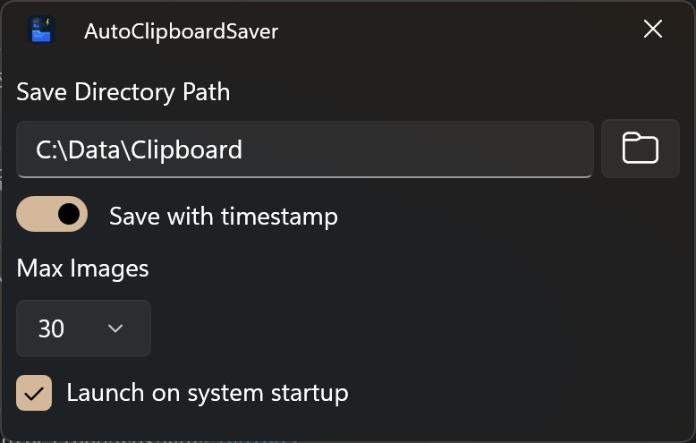

# AutoClipboardSaver

**[한국어](README.ko.md)** | English

A lightweight clipboard image auto-saver built with WinUI 3  

## Overview

AutoClipboardSaver is a system tray application that automatically monitors the clipboard and saves images to a specified folder whenever an image is copied. It runs silently in the background with minimal resource usage.

You can click the tray icon to open the settings window and configure the app.

## Features

- **Automatic Clipboard Monitoring** — Detects clipboard image changes in real-time and saves them as JPEG files
- **Timestamp Mode** — Save each image with a unique timestamp filename, or overwrite a single `clipboard.jpg` file
- **Max Images Limit** — Automatically delete oldest images when the folder exceeds the configured limit (timestamp mode only)
- **Custom Save Directory** — Choose any folder to save clipboard images
- **System Startup** — Optionally launch on Windows startup
- **System Tray** — Runs in the background with a tray icon; right-click to access settings and context menu
- **Modern UI** — WinUI 3 interface with Mica backdrop
- **Multi-Language Support** — English, Korean, Japanese, Chinese (Simplified)

## How It Works

1. The app starts and sits in the system tray
2. Whenever you copy an image to the clipboard (e.g., screenshot, copy from browser), the app detects it
3. The image is automatically saved as a JPEG file to your configured save directory
4. If **Save with timestamp** is enabled, each image gets a unique filename like `clipboard_2026-04-01_09-15-30.jpg`
5. If disabled, the image always overwrites `clipboard.jpg`

## Author

**Howon Lee (airtaxi)**

- GitHub: [@airtaxi](https://github.com/airtaxi)

## Contributing

Contributions are welcome! Please feel free to submit a Pull Request.
